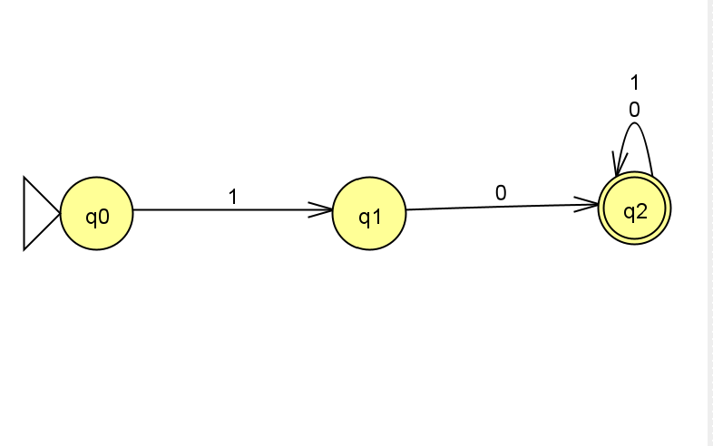
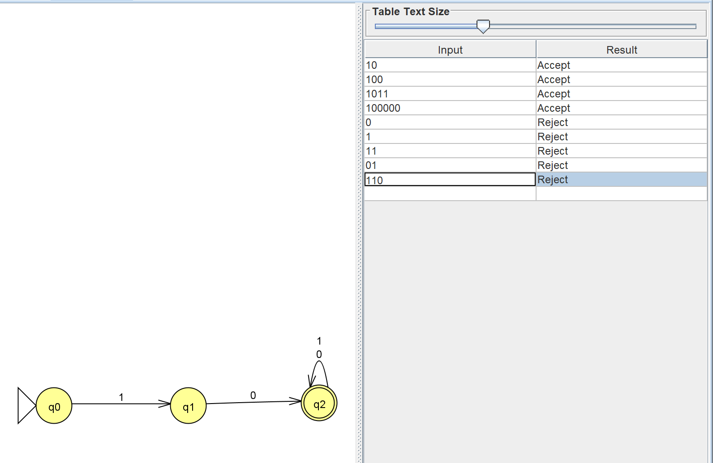

# Problem 6 Report

Language: strings over `{0,1}` that start with `10`.

# NFA picture

# Batch run

# Notes

The NFA must read `1` and then `0` before entering the accepting state. Once it reaches the accepting state, it can read any remaining symbols.
