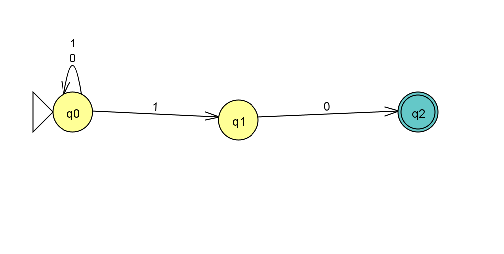
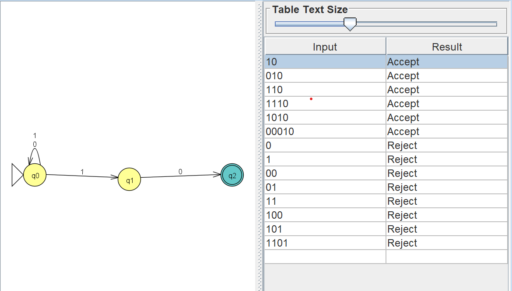

# Problem 7 Report

Language: strings over `{0,1}` that end with `10`.

# NFA picture

# Batch run

Run `n07t.txt` using **Input → Multiple Run**, then insert the screenshot here.

# Notes

The NFA keeps one path that scans the string and nondeterministically guesses which `1` begins the final `10`.
